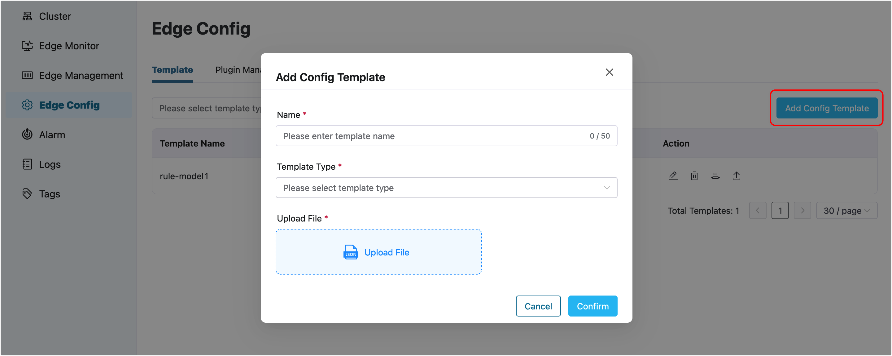
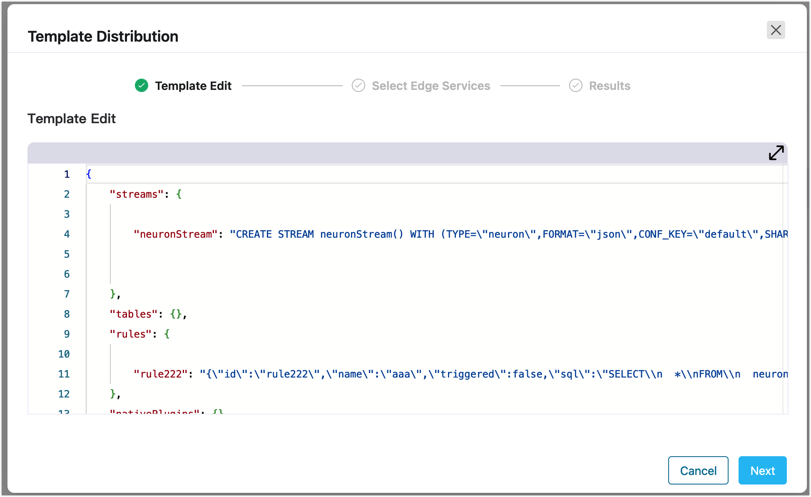
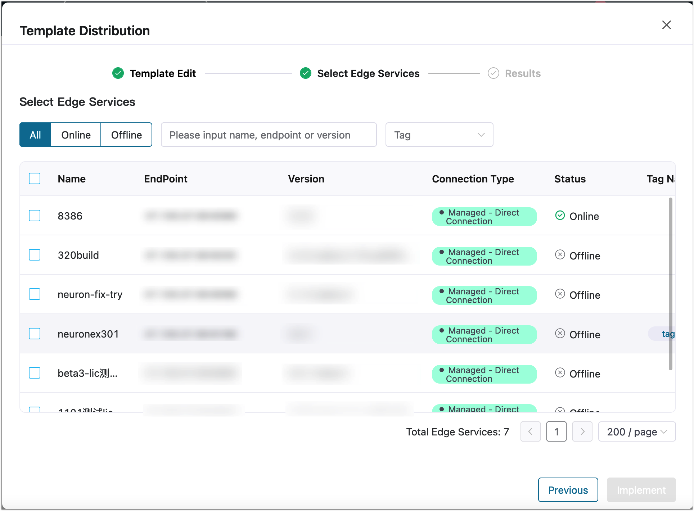
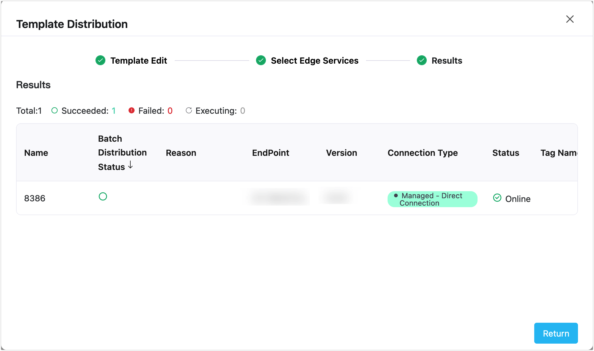
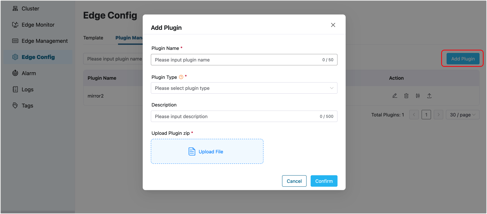
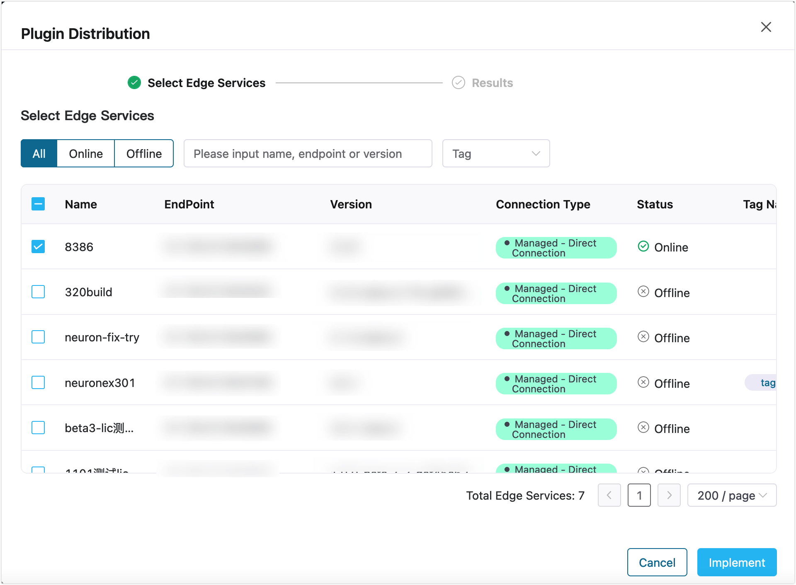
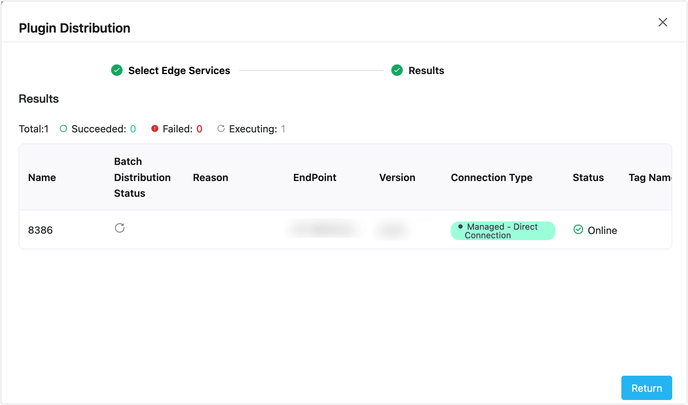

# Edge Service Config Management and Delivery

In the edge computing environment, various softwares run on edge devices, each requiring custom configurations to meet specific business requirements.

With ECP, you can easily deliver identical configurations to multiple edge devices. This approach helps administrators apply rapid, consistent and reliable configuration strategies, minimize configuration errors and redundant tasks, in order to boost the stability and reliability of the edge computing environment.

:::tip

ECP sets restrictions for system protection purposes. For details, please refer to [System Usage Restrictions](../others/known_limitations) and [Version Compatibility](../others/version_limitations).
:::

## Manage and Deliver Config Template

ECP supports creating config templates for NeuronEX's rules or southbound devices, as well as delivering these templates to edge services. 

### Create Config Template

Log in as system admins, organization admins, or project admins, navigate to **Workspace** -> **Edge Config**, and enter into the **Template** tab, then click the **Add Config Template** button.

You can choose "Rule" or "South Device" for **Template Type**. Template file can be exported from NeuronEX's rule or southbound driver pages, and uploaded with further modifications. Please note that template names must be unique.

After creating a template, you can further edit it, export its content, or delete the template.

### Deliver Template

Click the **Template Distribution** button in the **Action** column to open the template delivery window.

In the pop-up window, you can make necessary modifications to the template content. The modifications will only affect the current delivery and will not be saved in the template.

Click the **Next** button to choose the target edge services to which the template will be delivered. You can quickly locate service instances by filtering on their name, endpoint, version or tags and select them by checking the checkbox.

Click the **Implement** button, and ECP will deliver the template to the specified target edge services. The delivery status will be displayed on the results page in real-time. Please wait on this page for a moment to view the following results:

- The total number of edge service instances to be configured, the count of successful delivery, and the counf of failed delivery, will be displayed. A `green circle` indicates a successful delivery, while a `red exclamation mark` indicates a failed one.

- Failure reasons can be checked in the **Reason** column.

To review the previous delivery results, you can search from the **Audit** page under the **Administration** menu.

## Manage and Deliver Plugin

ECP supports delivering extensions to edge services. 

### Create Plugin

Log in as system admins, organization admins, or project admins, navigate to **Workspace** -> **Edge Config**, and enter into the **Plugin Management** tab, then click the **Add Plugin** button.

Portable plugin is supported for now. To get information of devloping a portable plugin, please refer to [Portable plugin development](https://docs.emqx.com/en/neuronex/latest/streaming-processing/extension.html#portable-plugin-development).

The uploaded plugin package must be in ZIP format, and the JSON file within the plugin package must match the input plugin name to ensure successful delivery. Duplicate creation of plugin packages with identical content is not supported.

### Deliver Plugin

Click the **Plugin Distribution** button in the **Action** column to open the plugin delivery window.

In the pop-up window, you can choose the target edge services to which the plugin will be delivered. Locate service instances by filtering on their name, endpoint, version or tags and then select them by checking the checkbox.

Click the **Implement** button, and ECP will deliver the plugin to the specified target edge services. The delivery status will be displayed on the results page in real-time. Please wait on this page for a moment to view the following results:

- The total number of edge service instances to be configured, the count of successful delivery, and the counf of failed delivery, will be displayed. A `green circle` indicates a successful delivery, while a `red exclamation mark` indicates a failed one.

- Failure reasons can be checked in the **Reason** column.

To review the previous delivery results, you can search from the **Audit** page under the **Administration** menu.

