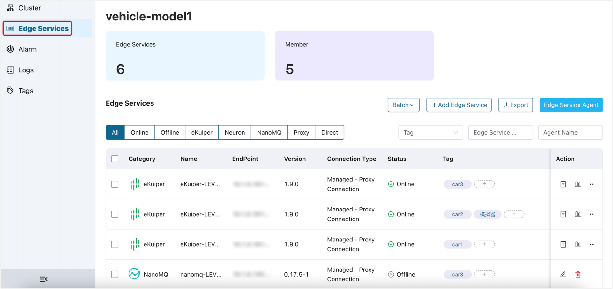

# Manage Edge Services

## Edge Service

Edge service NeuronEX can realize data collection, data preprocessing, edge computing and other capabilities. In many industrial scenarios, a large number of edge services need to be deployed to achieve data interconnection, global optimization and agile production.

Edge service management is one of the core functions of the ECP platform. ECP supports the batch creation and management of hundreds of edge service instances in Kubernetes, docker and other environments, completes real-time data collection and edge computing tasks, and supports edge service configuration management and batch configuration distribution, and accelerate the rapid deployment and implementation of IIOT projects.

## Access Edge Services Workspace

After logging in, you can find the **Workspace** option in the ribbon area. Click on it to navigate to the **Workspace - Edge Services** page. This page provides an overview of the edge services hosted or managed by ECP and displays the current number of members in your organization. 

:::tip

System admin, organization admin, project admin, and regular users all can access this page, however, regular users do not have access to the administration page.

For the permission of each role, see [Permissions and Roles](../acl/authorize.md#permissions-and-roles).

:::

There are some functional differences between ECP deployments based on Kubernetes and those based on Docker. For details, see [Kubernetes vs. Docker Deployments](../install/introduction.md#feature-difference-between-kubernetes-and-docker-deployment).

 

Below are topics that will be covered in this chapter:

- [Project Level Overview](./edge_project_statistics.md)
- [Install Edge Service in Bulk](./batch_intall)
- [Add Existing Edge Services](./batch_import)
- [Authenticate Edge Services](./e2c)
- [Tags and Grouping](./batch_tag)
- [Upgrade Edge Services](./batch_upgrade)
- [Edge Config Management and Delivery](./edge_resource_management)
- [Edge Service Management & Operations](./edge_ops)

<!--Overall, I think we should state the difference between K8s and docker deployment-->
