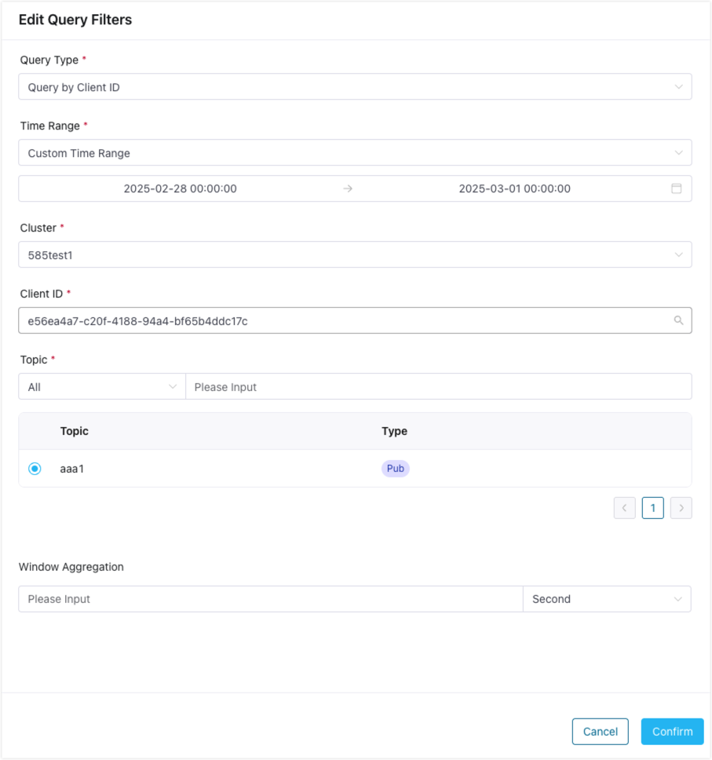
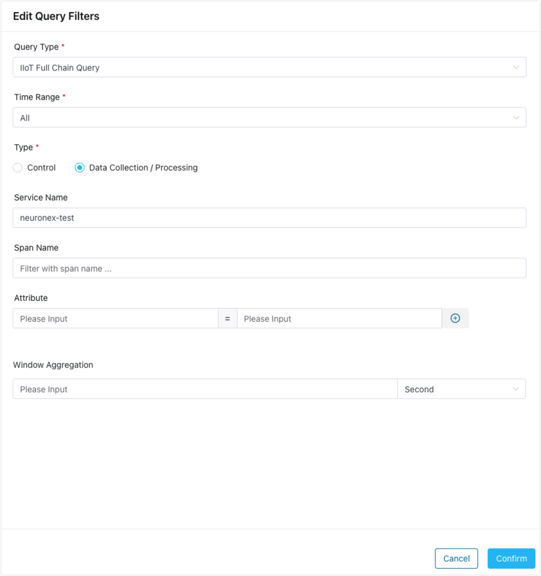

# Trace

[OpenTelemetry Tracing](https://opentelemetry.io/docs/concepts/signals/traces/) is a specification for tracing the flow of requests in distributed systems, used to track the flow of requests within distributed systems. ECP integrates OpenTelemetry tracing and provides the capability for visual analysis of the performance and behavior of requests.

## Trace Setting

Log in to ECP as an administrator , you can view the traceability configuration under **Administration** -> **System Setting** -> **General Setting**, which is the address of the [OpenTelemetry Collector](https://opentelemetry.io/docs/collector/getting-started), and the retention days to keep the traceability data. Trial licenses retain only 1 day of traceability data, while official licenses can adjust the data retention period as needed.

## Traceability Records

After the trace data is uploaded to ECP, on the **Workspace** interface, click the **Maintenance** -> Trace** menu on the left to enter the traceability list.

### Query for EMQX Cluster Traceability Records

If EMQX has enabled end-to-end tracing and configured the OpenTelemetry Collector service address provided by ECP, you can find MQTT message traceability data for specified client IDs and topics, as well as corresponding online/offline records and subscription/unsubscription records in ECP.

Click the **Edit Query Filters** button, and choose 'Query by Client ID' or 'Query by Topic' for the query type. Specify a time range and enter or select the cluster identifier. Then, filter for the needed client IDs and topic names. The query results are visually displayed in a chart. You can view a bubble chart showing the distribution of message traceability data over time and the overall duration. Similarly, you can also switch to a table view.

Click on a traceability record to view the details and observe the traceability situation. If there is an error in a traceability record, it will be highlighted in red in the chart, making it easy for you to quickly identify and troubleshoot the issue.

If there are too many traceability records within the query range to be displayed on the page at the same time, specify the window aggregation time before querying. An average duration trend chart aggregated by time will then be displayed. You can make a smaller range selection on the trend chart to view the traceability records within the selected range.

**Online/Offline** records display the connection and disconnection traceability data for the specified client ID within the corresponding time range. **Subscription** records display the subscription and unsubscription traceability data. Both further assists in the analysis of traceability behavior.

**Advanced Query** provides the ability to query all traceability data for one or more client IDs.

### Query for IIoT Traceability Records

If NeuronEX has enabled traceability and configured the OpenTelemetry Collector service address provided by ECP, you can also find the corresponding traceability data in ECP. Furthermore, if the IIoT chain uses an EMQX cluster, the traceability data will include the full-chain information from NeuronEX to EMQX.

Click the **Edit Query Filters** button, and choose 'IIoT Full Chain Query' for the query type. Specify a time range and select the operation type. Optionally, provide the service name, span name, and attributes to locate the IIoT traceability data.

