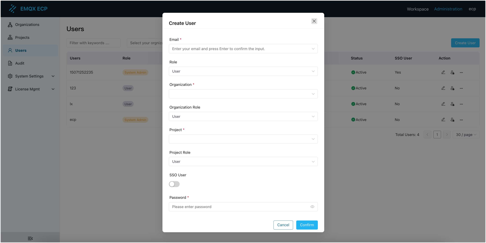

# Manage Users

After logging in to the ECP platform with the [superuser account](../install/install_ecp_on_kubernetes.md#create-a-superuser), system admins can perform user management-related tasks such as creating users and resetting passwords, [login authentication](../acl/authorize.md), [access control authorization](../acl/ecp_login.md), and monitoring user access and activities for platform stability and security.

In the **System Management** interface, navigate to the **User** menu on the left to access the user list. Here, system admins can view user details such as username, system role, email, phone number, last login time, and account activation status. You can also perform fuzzy searches based on username, email, organization, and role.

ECP supports creating users or inviting users by their emails. 

## Create Users

:::tip Prerequisite

- Ensure that you have the necessary email addresses of the users to be created.
- Enter **System Settings** -> **General Settings** -> **User Invite** as system admin and set **Invite Method** to 'None'.

:::

1. Log in to ECP as system admin. 

2. In the left navigation menu, click **Users**. 

3. Click **Create User**. Then in the pop-up dialog box, enter a username, their email, grant a role, and password. 

   - **Email**: 
     - Input one or more valid email addresses to create single or batch users.
   - **Role**: Choose either of the following roles:
     - **Admin**: Admin has the highest level of permissions to manage resources on the ECP platform, including all organizations and projects.
     - **User**: New users cannot access organizations or projects. To grant access, see [Edit Users](#edit-users) or [Organization and Project](./introduction.md).
   - **Organization and Project**: 
     - Choose the default organization and project for the user, and choose either user or admin role for the organization and project.
   - **SSO User**:
     - An SSO user can only log into ECP via third-party sso authentication system, instead of username and password.
     - A non-SSO user should be created with initial password configured. The password should contain at least 8 characters and should be a combination of letters, numbers, or symbols.

4. Click **Confirm** to finish the creation. 

## Invite Users

To accommodate users with specific security requirements for their usernames and passwords, ECP allows system admins to add them via email invitations. This feature also facilitates efficient batch user addition.

To invite users via email, system admins should first set the user invite method to email, then invite the users via email. 

### Set User Invite method

1. Log in to ECP as system admin. 
2. In the left navigation menu, click **System Settings** -> **General Settings**. 
3. Navigate to **User Invite**, and click **Edit**. 
4. Select **Email** from the **Invite method** drop-down list. 
5. Set the **Invitation email expiration date** and **Password reset expiration time**, or you can keep the default settings. 
6. Click **Save** to confirm the setting. 

### Invite Users 

1. Log in to ECP as system admin. 
2. In the left navigation menu, click **Users**. 
3. Click **Invite User**. Then in the pop-up dialog box, enter the email and press enter to confirm the input. At most 10 emails can be added. Then set roles for the invited users. 
   - **Admin**: Admin has the highest level of permissions to manage resources on the ECP platform, including all organizations and projects.
   - **User**: New users cannot access organizations or projects. To grant access, see [Edit Users](#edit-users) or [Organization and Project](./introduction.md).
4. Click Invite Users and ECP will automatically send the invitation email.

5. On the **Users** page, you will find the invited users listed under the **To Activate** status. Once the invited users complete their account creation process, their status will change to **Active**.

## Edit Users

On the **Users** page, system admins can manage users by utilizing the icons available under the **Action** column. The following operations are supported:

- Edit Users: By clicking the edit icon next to each user, you can modify their user profile details, such as their name, email, and role.
- Enable/Disable Users: Use the enable/disable icon to activate or deactivate users. When a user is disabled, they will no longer be able to log in or access system functions. Exercise caution when disabling a user, as it may impact the organization they are associated with.
- More Options: Clicking the more icon provides additional options, including:
  - **Reset Password**: Allows you to reset the user's password.
  - **Add to Organization**: Enables you to add the user to an organization.
  - **Delete**: Clicking **Delete** permanently removes the user. Please confirm the action in the pop-up dialog box before proceeding.
