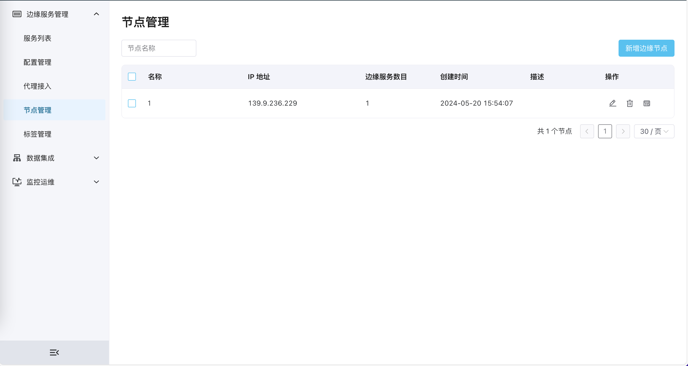
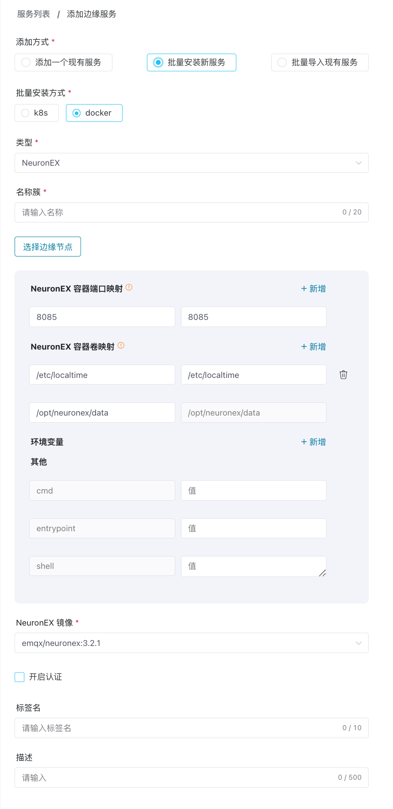

# Docker 方式托管部署边缘服务

基于 Docker 方式部署的 ECP 平台，如果边缘服务的硬件支持部署 Docker 容器，可在 ECP 平台上批量安装边缘服务，缩短边缘服务的安装与部署时间，提高部署效率和一致性。

## 前置条件

边缘服务的批量安装之前，需要完成以下准备工作：

- [配置 Docker 环境](#配置-docker-环境)
- ECP 上配置 [Docker 连接配置](../system_admin/resource_config.md#docker连接配置)
- 添加[边缘服务镜像](../system_admin/resource_config.md#边缘服务镜像列表)
- 在[边缘节点管理](#边缘节点管理)页面添加边缘节点，后续边缘服务将安装在边缘节点上

### 配置 Docker 环境

边缘服务 NeuronEX 部署机器上需要安装 Docker 环境，具体安装步骤请参考[Docker 安装](https://docs.docker.com/engine/install/)。
安装完成后，需要打开 Docker API 的远程访问端口。 ECP 平台通过 Docker API 来管理边缘服务的生命周期，支持 Docker API 开启 TLS 认证和不开启 TLS 认证两种模式。
:::tip 注意
生产环境请使用开启 TLS 认证模式。
:::

#### 不开启 TLS 认证

1. 找到 docker 的服务配置文件， 默认为：`/usr/lib/systemd/system/docker.service` , 可以通过 `systemctl status docker` 命令看到该文件的位置。
   
2. 修改 ExecStart 参数，增加参数，如下所示：
   ```shell
   ExecStart=/usr/bin/dockerd  -H fd:// --containerd=/run/containerd/containerd.sock  -H=0.0.0.0:2376
   ```
   
3. 重启 docker 服务
   ```shell
   systemctl daemon-reload && systemctl restart docker
   ```
4. ECP 上配置[Docker 连接配置，不开启 TLS 认证方式](../system_admin/resource_config.md#不开启-tls-认证)

#### 开启 TLS 认证

1. 如果 Docker API 开启了 TLS 认证，则边缘节点部署 Docker 后，作为服务端需要配置 Docker API 的 CA 证书、服务端证书和服务端私钥，ECP 作为客户端需要配置 Docker API 的 CA 证书、客户端证书和客户端私钥，具体配置方法请参考[Docker TLS 认证](https://docs.docker.com/engine/security/https/)。

   1）可通过下载[该链接](https://github.com/emqx/emqx-ecp-docs/tree/main/ecp/resource/docker-tls)的证书文件及脚本进行配置，
   :::tip 注意
   该证书仅供测试使用，生产环境请使用自签名证书。
   :::

   2）修改 extfile.cnf 中 IP 地址为这台部署 Docker Engine 服务的边缘节点对外暴露的 IP 地址。该 IP 地址也是在 ECP 中添加[边缘节点](#边缘节点管理)时需要输入的 IP。
   
   3）执行 gen-docker-cert.sh 脚本， 生成服务端证书: server-cert.pem， 默认密码： `1111`;
   
   4）将生成的 `server-cert.pem`证书文件以及`ca.pem`、`server-key.pem`文件，拷贝到边缘节点的指定目录下，如： `/root/docker-tls/ca.pem` 、`/root/docker-tls/server-cert.pem` 、`/root/docker-tls/server-key.pem` 目录下。

2. 找到 docker 的服务配置文件， 默认为：`/usr/lib/systemd/system/docker.service` , 可以通过 `systemctl status docker` 命令看到该文件的位置。
   
3. 修改 ExecStart 参数，增加参数，如下所示：
   ```shell
   ExecStart=/usr/bin/dockerd  -H fd:// --containerd=/run/containerd/containerd.sock  --tlsverify --tlscacert=/root/docker-tls/ca.pem --tlscert=/root/docker-tls/server-cert.pem --tlskey=/root/docker-tls/server-key.pem -H=0.0.0.0:2376
   ```
   
4. 重启 docker 服务
   ```shell
   systemctl daemon-reload && systemctl restart docker
   ```
5. ECP 上配置[Docker 连接配置，开启 TLS 认证方式](../system_admin/resource_config.md#开启-tls-认证)

### 边缘节点管理

点击**工作台** -> **节点管理**，通过边缘节点管理，可以新增、编辑、查看和删除边缘节点。

#### 边缘节点注册

Docker 节点只有注册后才可以通过 ECP 在指定的 Docker 节点上部署边缘服务；

1. 选择 **组织** -> **项目**;
2. 点击 **边缘管理** ， 选择 **边缘节点管理** ， 点击**新增边缘节点**;
3. 填写边缘节点的名称、IP 地址、描述;


#### 边缘节点列表管理

1. 选择 **组织** -> **项目**;
2. 点击 **节点管理**;
3. 在列表中选择要管理的节点， 可以 **编辑**、**删除**、**查看**, 查看按钮表示该节点上的边缘服务列表；



#### 边缘节点上的边缘服务列表

在边缘节点列表上点击某边缘节点最右侧的 **查看** 按钮后， 可以看到该节点上的边缘服务列表；
可以在列表中看到这些边缘服务的状态等信息。


## 批量安装边缘服务

1. 以系统/组织/项目管理员的身份登录，在**工作台**页面，点击左侧导航栏的**服务列表**。

2. 点击**添加边缘服务**按钮，进入添加边缘服务页。

3. **添加方式**选择**批量安装新服务**。

4. **类型**可以选择 NeuronEX。

5. 输入边缘服务的名称前缀，系统会根据名称前缀自动生成唯一的服务名称；1-20 个字符，并支持 "-" 和空格。

6. 选择一个或多个**边缘节点**，ECP 要会在每一个边缘节点部署一个所选择**类型**的边缘服务实例。

7. 对边缘服务的配置参数进行设置，不修改将默认使用全局配置中的参数。

8. 选择需要安装边缘服务的镜像。

9. [可选]安装 NeuronEX 实例，可选择是否开启认证，具体信息，可查看[边缘服务认证](./e2c.md)。

10. [可选] 可以选择为边缘服务实例添加标签，方便后续维护。

11. ECP 会根据以上设定自动在页面右侧生成本次安装的信息概览，您可在此进行确认，如信息确认无误，可点击**确认**按钮，进行批量边缘服务的安装。



## 查看安装进度

点击确认后，将弹出批量安装结果对话框，您可在此查看：

- 安装总数、安装成功数、安装失败数和正在执行安装的统计数据；
- 对于安装失败的情况，您可在**原因**列查看安装失败的原因；


点击**返回**，返回到**边缘服务**页，新安装的边缘服务将出现在页面的边缘服务部分。

此外，ECP 会记录本次批量安装的全部信息，系统/组织/项目管理员可在[操作审计](../system_admin/operation_audit)中查看。

:::tip
批量安装的使用限制请参考[系统使用限制](../others/known_limitations)和[版本兼容性限制](../others/version_limitations)。
:::
