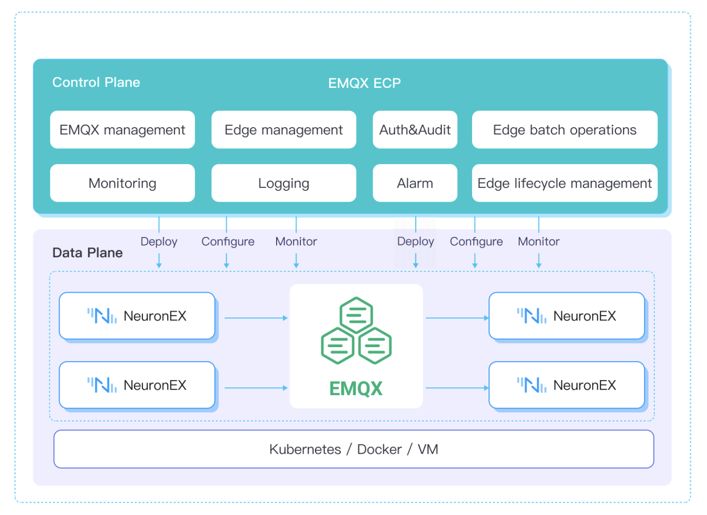

# 产品概览

## 产品简介
EMQX ECP一款面向工业4.0的工业互联数据平台，旨在满足工业场景大规模数据采集、处理和存储分析的需求，ECP提供边缘服务的快速部署、远程操作和集中管理等功能，助力工业领域数据互联互通，实现数据驱动的生产和运营。

## 产品优势

- **软件定义制造**

    将物联网、大数据、和人工智能等数字技术整合到生产制造过程中，以数据为核心进行生产监控和决策优化，实现智能化生产，提高效率、质量和可持续性。

- **消除数据孤岛**

    将工厂海量数据统一接入，利用统一命名空间架构（UNS） 实现系统的互操作性，连接从边缘到云的 OT 和 IT 系统，消除数据孤岛。

- **工业人工智能**

    将制造数据实时发送到云端进行 AI/ML 训练，然后将训练后的 ML 模型下发到工厂车间执行，实现生产计划优化、质量控制和预测性维护。

- **实时分析**

    支持实时流式数据处理和转发，可在边缘执行原始数据预处理、过滤和分析。减少延迟、节省带宽，并卸载云平台的计算任务。

- **云边协同**

    与云平台无缝集成，提供边缘软件的全生命周期管理，统一远程配置及管理。实时远程监控，及时发现运行异常，确保系统可靠运行。

- **无缝集成**

    可以与现场的硬件、网络等基础设施适配和集成。无论是服务器、工控机还是网关硬件，以及各类网络环境，都能够部署和使用，不受硬件厂商的限制。

## 功能一览

### 功能架构图

 

### 平台功能

 

[边缘服务管理](./edge_service/introduction.md)
- 远程配置管理

- 批量部署、升级、启停

- 配置模板及算法插件管理

- 批量配置下发

- 动态点位分配管理

[数据接入平台管理](./cluster/introduction.md)
- EMQX 集群管理

- EMQX 集群自动部署

- EMQX 集群一键扩缩容

- EMQX 集群版本管理

- 数据转发存储

[统一运维服务](./monitor/introduction.md)
- 边缘服务监控

- 健康监测及异常告警

- 告警管理、告警规则配置

- 告警推送

- 统一日志服务

[企业级服务](./system_admin/introduction.md)
- 操作审计

- 租户隔离

- 基于项目和用户角色的管理

- 业务分组

- 统一认证

<!--  -->

## 核心概念

以下为 EMQX ECP 中涉及的核心概念：

1. **云端软件**：指部署在云平台或数据中心端完成数据汇聚存储、统一运维管理的程序，ECP 和 EMQX 集群等。

2. **边端软件**：指的是运行在工业边缘端，实现数据采集接入、数据预处理计算及低延迟控制的应用程序，并且由 ECP 管理的 EMQ 边缘产品，这里指代 NeuronEX等。

3. **EMQX 集群**：EMQX 企业版提供一体化的分布式 MQTT 消息服务和强大的 IoT 规则引擎，为高可靠、高性能的物联网实时数据移动、处理和集成提供动力，助力企业快速构建关键业务的 IIoT 平台与应用。

4. **NeuronEX**：NeuronEX 是一款面向工业领域的设备数据采集和边缘智能分析的软件，主要部署在工业现场，实现工业设备通信及工业总线协议采集、工业系统数据集成、边端数据过滤分析及AI算法集成，以及工业互联网平台对接集成等功能，为工业场景提供低延迟的数据接入管理及智能分析服务。

5. **组织**：通过组织管理实现企业级多租户功能，即可以在一套系统中支持多个租户，每个租户之间互相独立且互不干扰，而系统管理员可以对每个租户进行单独的管理和维护。

6. **项目**：在组织(多租户)管理模式下，支持对多个项目进行管理。在每个组织(租户)下，可以建立多个项目，每个项目可以是一个完整的、独立的业务运营系统，都有自己的数据存储空间和资源分配，而这些项目之间也是相互独立的。这种管理方式可以提高系统的灵活性和可扩展性，同时也可以使组织管理员和项目管理员更加方便地进行维护和管理。

7. **角色**：ECP 云边一体化平台提供系统管理员、组织管理员、项目管理员和普通用户四种角色，基于 RBAC 模式设计和实现权限系统。

8. **任务**：任务是 ECP 所执行的特定任务或功能。这些任务能够在后台自动运行而无需用户干预，通常是由系统管理员、组织管理员、项目管理员在系统中执行的安装、升级、配置下发等操作。

9. **托管**：托管是指由 ECP 平台创建部署的边缘服务 NeuronEX 或 EMQX集群，称之为托管 NeuronEX 服务或托管 EMQX 集群。

10. **纳管**：纳管是指由用户创建部署的边缘服务 NeuronEX 或 EMQX集群，并在 ECP 平台添加纳入管理，称之为纳管 NeuronEX 服务或纳管 EMQX 集群。

11. **直连模式**：直连模式/直连 是指 ECP 平台可以直接访问到边缘服务或EMQX 集群，即 ECP 和边缘服务以及EMQX 集群在同一网络或 VPC中。

12. **代理模式**：代理模式/代理 是指 ECP 平台无法直接访问到边缘服务或 EMQX 集群并建立联系，即边缘服务或 EMQX 集群没有独立的IP。此时，边缘节点或 EMQX 集群需要通过一个代理服务，主动向ECP 发起连接，建立联系，随后 ECP 可与边缘服务或 EMQX 集群正常通讯。

