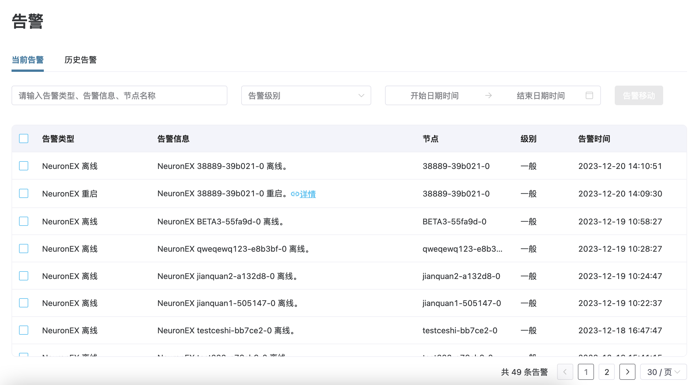
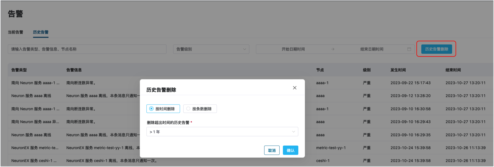
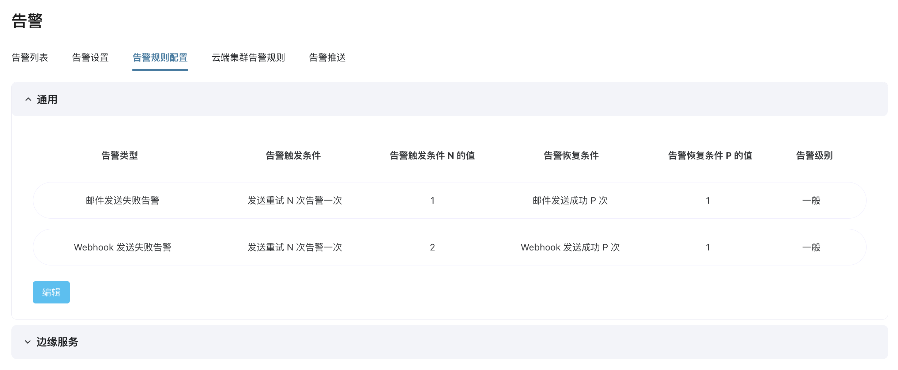
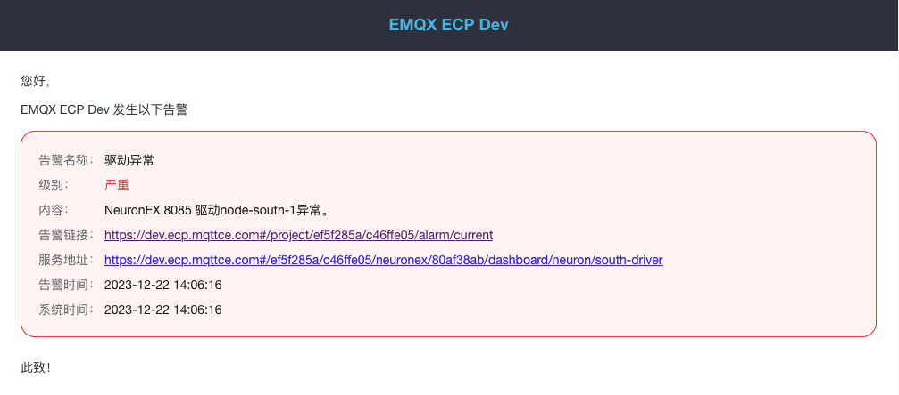
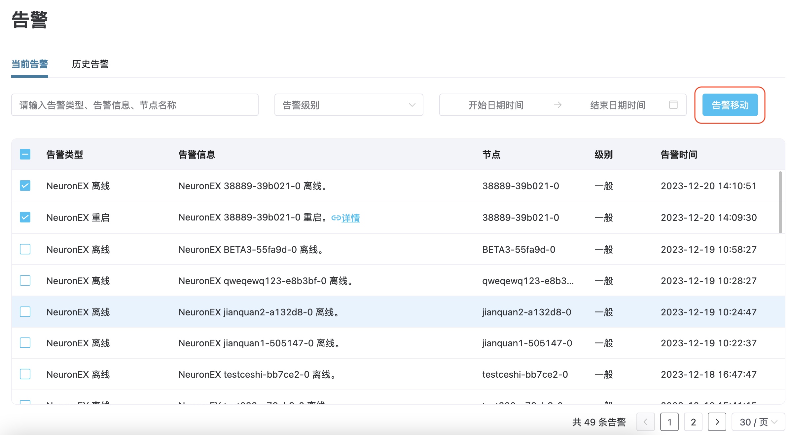
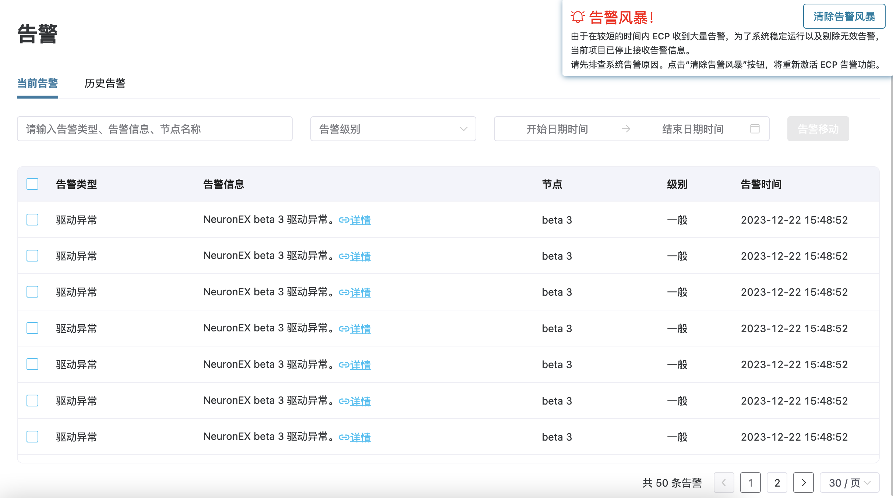

# 告警管理

ECP 统一告警通过设置告警相关规则实现对异常或故障的通知。支持对告警渠道的通知（包括邮件和 Webhook），以及通知范围、通知沉默时效的设置。

以管理员或普通用户身份登录 ECP，您可以在顶部菜单的报警图标上查看未解决的报警数量。点击图标或左侧导航菜单上的**告警**，即可打开**告警**页面，您可在此查看告警类型、告警消息、所在边缘服务、告警级别和告警生成时间等详细信息。

## 当前/历史告警

在**工作台**界面，点击左侧**监控运维** -> **告警**菜单或点击顶部**告警图标**即可进入告警列表。

- 在**当前告警**选项卡，当前告警列表显示正在发生的未被处理的告警事件，包括告警类型、告警信息、所在边缘服务、告警级别和发生告警的时间。
- 在**历史告警**选项卡，显示历史发生过的已经被处理的告警事件，包括告警类型、告警信息、所在边缘服务、告警级别和告警的开始和结束时间。



您同样可以通过 ECP 的过滤和筛选功能，从告警类型、告警消息、边缘服务名称、告警级别和告警时间等方面快速定位某条告警。

### 历史告警删除

ECP 支持对历史告警的清理，在**历史告警**选项卡中点击 **历史告警删除** 按钮，可选择按时间，或按条数删除历史告警记录。

- 按时间删除：告警发生时间超出指定时间范围的所有历史告警记录将被删除。
- 按条数删除：按告警发生时间，从最早的开始删除指定条数的历史告警记录。按条数删除单次操作删除上限为5万条。




## 告警设置

以系统/组织/项目管理员的身份登录 ECP，在告警页面的**告警设置**选项卡中，您可以对告警状态、通知范围、通知沉默时效、自定义告警开启状态等进行设置。


### 告警状态

可通过滑动**告警状态**开关确定是否激活该项目的告警功能。

### 通知范围

告警分为`严重`和`一般`两类。`严重`适用于需要尽快处理的告警，`一般`适用于不对生产环境产生过大影响。

勾选”仅通知严重告警事件“后，将只通知严重类告警事件；如未勾选，将通知所有告警事件。

“通知”是指将告警发送至**告警推送**卡片中配置的相应邮件及 Webhook，不论通知范围如何选择，所有的告警事件仍将展示在当前/历史告警选项卡中。

### 通知沉默时效

您可以配置通知沉默时效范围，以及沉默时效的对象。

如果沉默时效对象设置为“单条告警级别”，在沉默时效时间范围内，ECP 不会就同一条告警反复发送通知；超过沉默时效后，将会继续推送告警通知。

如果沉默时效对象设置为“边缘服务/集群实例级别”，在沉默时效时间范围内，同一个边缘服务或同一个集群上产生的任何告警都不会触发反复通知；只有超过沉默时效后，ECP 才会继续推送告警通知。

通知沉默时效只影响邮件及 Webhook 的告警推送，不论如何选择，所有的告警事件仍将展示在当前/历史告警选项卡中。

### 自定义告警

如果您的边缘服务希望在业务处理过程中将其他的告警信息推送至 ECP，可以通过集成自定义告警 API 来实现。

首先您需要打开“自定义告警开启状态”，然后查看并复制自定义告警的 API 信息，包括请求 URL 及请求头部需要指定的 secret。如果需要重置 secret，请通过“刷新”按钮重新生成。

 

#### 示例

**POST** {自定义告警 URL}

- 请求头部：

```
X-ECP-Alarm-Token: {自定义告警 Secret}
Content-Type: application/json
```

- 请求内容：
  - `message` 字段必须指定，类型为字符串，表示告警的具体内容，将展示在页面上当前告警/历史告警列表中。
  - `timestamp` 字段必须指定，类型为字符串，表示告警发生的时间戳（以秒为单位）。超过 10 分钟的告警信息将不会被接收。
  - `severity` 字段值需为 0 或 1，0 表示该条告警级别为一般，1表示告警级别为严重，默认值为 0。`severity` 字段值将影响告警的通知范围，请参考上文“**告警基础设置 > 通知范围**”部分。
  - `tag` 字段为可选字段，类型为字符串，表示标签名称。如果指定 `tag` 字段，将使用该标签名称对应的推送设置进行告警推送，请参考上文“**告警推送设置**”部分。如果未指定 `tag` 字段或指定的标签名称不存在，则该告警只显示在页面当前告警/历史告警列表中，不会进行邮件或 Webhook 的推送。
  - `uuid` 字段为可选字段，类型为字符串，表示该条告警的唯一标识。如果多条自定义告警使用了相同的 UUID，则这些告警将被视为同一条告警，受到沉默时效的控制，请参考上文“**告警基础设置 > 通知沉默时效**”部分。如果未指定 `uuid` 字段，ECP 将为每条自定义告警随机生成唯一标识。
   ```json
  {
    "message": "message details for custom alarm",
    "timestamp": "1711433603",
    "severity": 1,
    "tag": "customTag",
    "uuid": "of9MHKAj"
  }
   ```

## 告警规则配置

以系统/组织/项目管理员的身份登录 ECP，在告警页面的**告警规则配置**选项卡中，您也可以对告警规则进行设置。



ECP 目前支持的告警规则包括 ECP 端通用规则、边缘服务触发的规则，及云端集群触发的规则三类。通用规则包括：邮件发送失败、Webhook 发送失败。由边缘服务触发的规则包括：驱动异常、规则异常、NeuronEX 离线、NeuronEX 重启。由云端集群触发的规则包括：EMQX 规则异常、EMQX 连接器异常。规则的详情请参见[统一运维服务 - 告警规则列表](../monitor/rules.md)。

除 **NeuronEX 重启**告警规则外，您可以对其他告警规则的触发条件和恢复条件进行设置。如果希望告警更为敏锐，您可以设置较小的触发值；如果希望告警不要过于频繁地触发，您可以设置较大的触发值。触发值和恢复值目前可设置的上限为10。

您也可以对所有的告警规则设置“严重”或“一般”的告警级别用于标识严重程度。如果通知范围指定为“仅通知严重告警事件”，那么一般级别的告警将只会显示在当前/历史告警选项卡中，不会推送到邮件及 Webhook 中。

## 告警推送设置

以系统/组织/项目管理员的身份登录 ECP，在告警页面的**告警推送**选项卡中，您还可以对告警推送进行设置。


ECP 支持设置一个或多个告警推送，不同的告警推送通过指定标签关联到边缘服务上，或者在打开“EMQX 告警推送”的前提下关联到集群上。当这些关联的边缘服务或 EMQX 集群产生告警时，告警将发送到相应的邮件及 Webhook 上。


### 被告警的边缘服务标签

如果选择“全部”，项目中任何边缘服务上产生的告警都将被发送到当前告警推送设置的邮件及 Webhook 上。也可以选择一个或多个标签，只有关联了标签的边缘服务产生的告警才会发送到设置的邮件及 Webhook 上。

请注意：如果告警是项目级别的，如邮件发送失败告警、Webhook 发送失败告警，则所有的告警推送中配置的邮件及 Webhook 都将收到通知。

### EMQX 告警推送

如果开启 EMQX 告警推送，项目中任何集群上产生的告警都将被发送到当前告警推送设置的邮件及 Webhook 上。

### 邮件通知

1. 滑动**邮件通知**开关为启用状态。
2. 根据邮件格式输入收件人地址并按回车确认，可以输入多个收件人地址，目前最多支持 10 个收件人地址。
3. 发生告警后，设置的邮箱地址会收到告警通知。



### Webhook 通知

1. 滑动 **Webhook** 开关为启用状态。
2. 设置 Webhook 地址；输入完成后，点击**测试**检查 URL 的连通性。
3. 如有校验信息需要，您可设置 **HTTP Headers**。
4. 您可点击 **JSON 模版预览**查看 Webhook 告警样式，ECP 支持用户自定义告警样式，请参见[统一运维服务 - 系统级别设置 - 告警](./introduction.md#系统级别设置)。
5. 发生告警后，设置的 Webhook 地址会收到告警通知。


## 告警移动

当前告警达到恢复条件后，系统自动将其从当前告警转到历史告警。

您也可以勾选当前告警中的一个或多个告警，点击 **告警移动** 按钮，将它们移动到历史告警中。



## 告警风暴

如果在短时间内，同一个边缘服务实例上产生相同类型或不同类型的多个告警，沉默时效将会加以控制，以减少重复的告警通知，您可以根据实际业务需要，设置不同的沉默时效时间范围、作用对象及告警规则严重级别来平衡告警的有效性和冗余性。

如果在短时间内，由于宿主机、Kubernetes 平台或应用程序发生故障或意外情况，而引起不同的边缘服务实例都产生大量告警，则视为告警风暴。

这些告警可能是重复的、不必要的、甚至会对整个系统的稳定性造成影响，ECP 会对告警内容进行收敛和聚合来减少不必要的告警通知，并发送一封告警风暴的告警邮件，同时也需要您评估告警规则的阈值设置是否正确和合理。

下面表格详细说明了告警风暴的发生条件，及发生后的相应策略：
| 告警风暴发生条件                                             | 告警风暴后续应对策略                                         |
| :----------------------------------------------------------- | :----------------------------------------------------------- |
| 1 分钟内单个项目中触发 50 条或更多的告警，将引发该项目的告警风暴 | 1.发生告警风暴的项目将停止接收告警信息<br/>2. 当前告警选项卡将不再持续更新<br/>3. 邮件及 Webhook 通知将停止推送 |

告警风暴发生后，将在**告警**页面突出显示以提醒用户。您在完成排除告警原因解决系统问题后，点击 **清除告警风暴** 按钮，当前项目的告警功能将恢复正常。




```

```