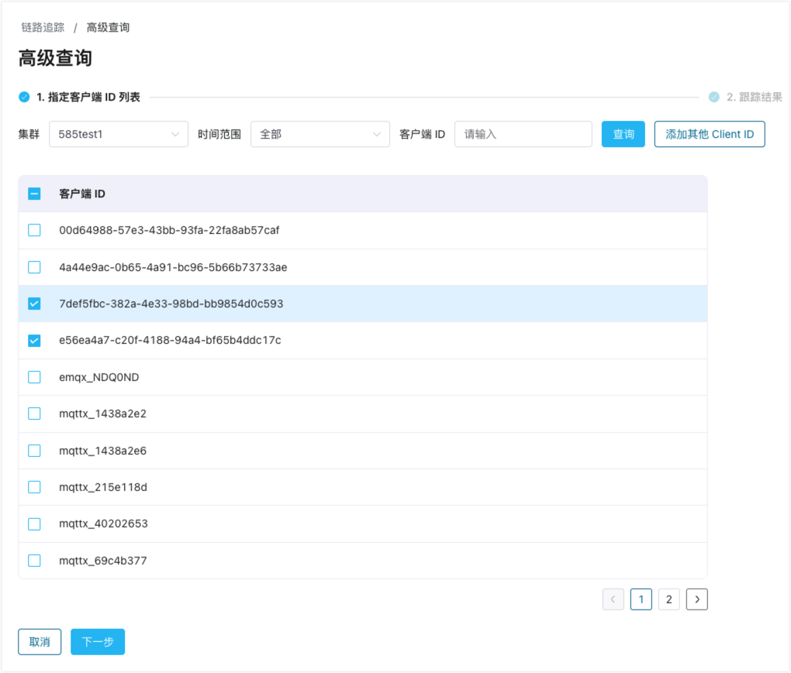
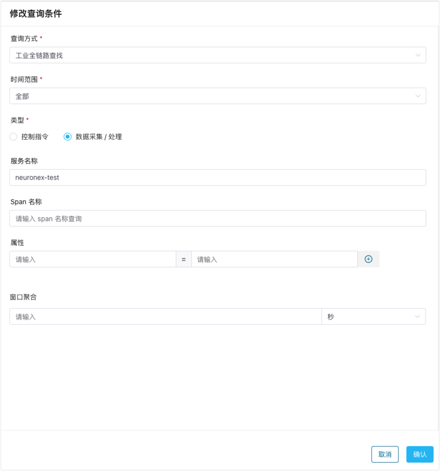

# 链路追踪

[OpenTelemetry 追踪](https://opentelemetry.io/docs/concepts/signals/traces/)是一个用于追踪请求在分布式系统中的流动的规范，用于追踪请求在分布式系统中的流动情况。 ECP 集成 OpenTelemetry 追踪，并提供了可视化分析请求的性能和行为的能力。

## 链路追踪配置

以管理员或普通用户身份登录 ECP，您可在**系统管理**->**系统配置**-> **通用配置**查看链路追踪配置，即 [OpenTelemetry Collector](https://opentelemetry.io/docs/collector/getting-started) 的地址，以及链路追踪数据保留天数。试用许可证仅保留 1 天链路数据，正式许可证可以按需调整数据保留天数。

## 链路追踪记录

当链路数据上传到ECP后，在**工作台**界面，点击左侧 **监控运维->链路追踪** 菜单即可进入链路追踪列表。

### 查询 EMQX 集群链路数据

如果 EMQX 集群启用了端到端追踪，并配置了 ECP 提供的 OpenTelemetry Collector 服务地址，在 ECP 端可以查找指定客户端 ID 及主题的 MQTT 消息追踪链路数据，以及相应的上下线记录和订阅/取消订阅记录。

点击 **修改查询条件** 按钮，查询方式选择“以客户端 ID 查找”或“以主题查找”。并指定时间范围，输入或选择集群标识符，然后根据查询方式过滤并筛选到所需的客户端 ID 及主题名。查询结果以图表进行可视化展示，您可以直观地查看到所有符合查询条件的消息追踪链路数据按时间分布的耗时气泡图，以及整体的耗时情况。同样地，您也可以切换为表格形式查看。

点击某条链路数据，可以查看链路详情，观察链路情况。如果某条链路中有异常发生，该链路将在图表中以红色高亮显示，方便您快速排查问题。

如果查询范围内的链路数据过多，无法在页面上同时展示，请先指定窗口聚合时间后查询，此时将展示按时间聚合的平均耗时趋势图，您可以在趋势图上进行更小范围的框选，以查看框选范围内实际的链路情况。

**上下线记录** 展示指定的客户端 ID 在相应时间范围内的连接和断开的链路数据，**订阅记录** 展示指定的客户端 ID 在相应时间范围内的订阅和取消订阅的链路数据，进一步帮助分析链路行为。

**高级查询** 提供了查询一个或多个客户端 ID 所有链路数据的能力，您可以在此针对客户端进行链路行为的分析。

### 查询工业全链路数据

如果 NeuronEX 启用了链路追踪，并配置了 ECP 提供的 OpenTelemetry Collector 服务地址，在 ECP 端也可以查找到相应的链路数据。更进一步，如果该工业链路使用了 EMQX 集群，链路数据中将包含从 NeuronEX 到 EMQX 的全链路信息。

点击 **修改查询条件** 按钮，查询方式选择“工业全链路查找”，并指定时间范围，选择操作类型，并有选择地提供服务名称、Span 名称、属性，来定位所属的工业链路数据。

