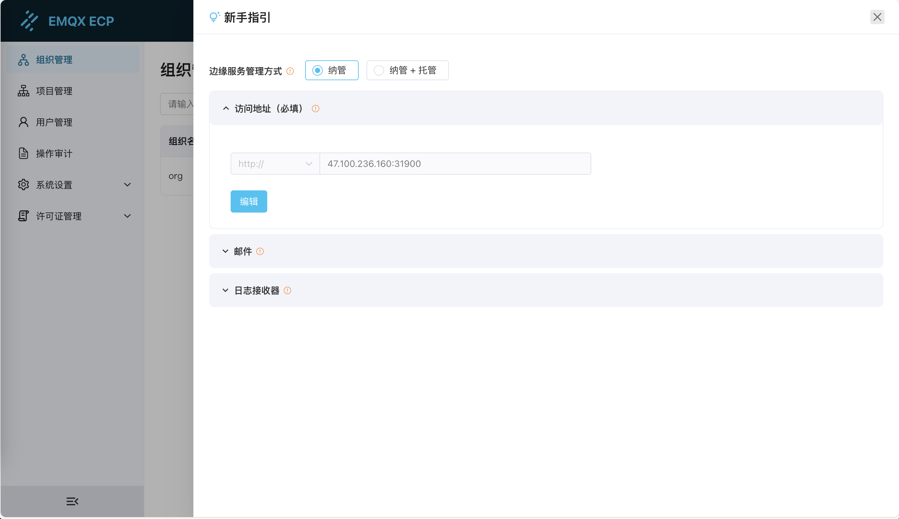
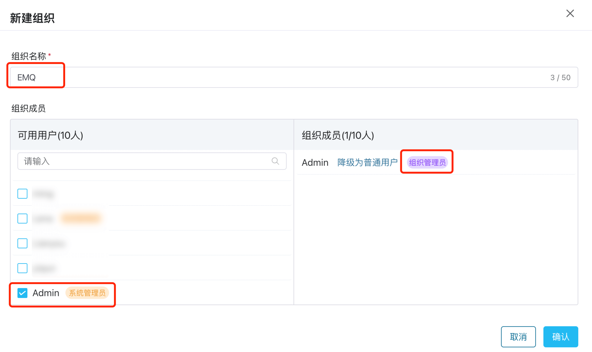
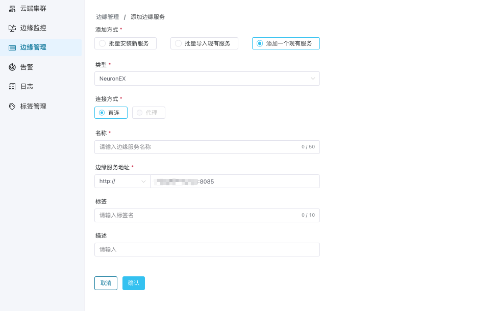
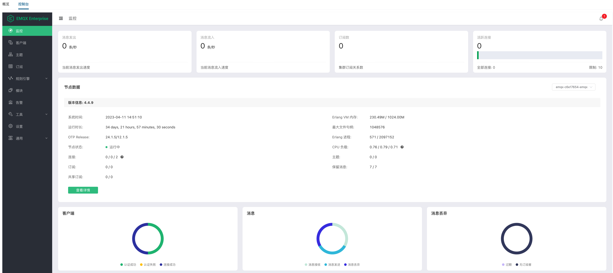

# 快速开始

ECP 提供了基于 Docker 快速部署的方式，帮助用户快速搭建 ECP 工业互联数据平台。在本章节中，用户可以通过简单的几步操作，快速体验 ECP 的功能和特性。

## 安装 ECP

请参考[基于 Docker 部署 ECP](../install/install_ecp_on_linux) 章节，准备部署资源，并安装 ECP。

## 初始化环境配置

ECP 安装完成以后，登录进 ECP 的 Dashboard 页面，还要经过以下步骤的初始化环境配置，才能正常使用。

| 步骤                                                       | 说明                                                       |
| :--------------------------------------------------------- | :--------------------------------------------------------- |
| [配置访问地址](../system_admin/general_config.md#访问域名) | 配置访问域名，边缘服务需要通过该地址推送状态信息。         |
| [配置邮箱](../system_admin/general_config.md#邮件配置)     | 可选，配置告警邮件推送的邮件服务器。                       |
| [配置许可证](../install/license_setting.md#配置许可证)     | ECP 安装后自带试用 License，您也可以申请并上传新的许可证。 |

超级管理员也可在首次登录后，通过新手指引进行配置。

:::tip 注意
[纳管](../index.md#核心概念)是指对现有边缘服务 NeuronEX 进行管理，纳管后，ECP 将对 NeuronEX 进行监控、告警、日志、配置下发等管理和运维操作。纳管边缘服务 NeuronEX 需要先部署 NeuronEX，详情请参考[NeuronEX 快速开始](https://docs.emqx.com/zh/neuronex/latest/quick-start/quick-start.html)。

[托管](../index.md#核心概念)是指由 ECP 平台创建部署的边缘服务 NeuronEX ，支持由 ECP 部署、启停以及升级。
:::



## 通过 ECP 管理边缘服务

初始化 ECP 的运行环境之后，本教程将通过创建/管理边缘服务，带您体验 ECP 的各项功能。

### 创建组织/项目

ECP 通过组织/项目管理功能实现了企业级多租户管理。管理边缘服务 NeuronEX 以及 EMQX 集群 都需要建立在具体项目上，所以我们首先需要创建组织和项目。

1. 以系统管理员的身份登录 ECP，切换到**系统管理**界面。
2. 点击左侧菜单栏的**组织管理**。
3. 在组织管理列表页点击**新建组织**，在弹出的对话框中，进行如下设定：

   - **组织名称**填入 **EMQ**；
   - 在左侧的**组织成员**列选择组织成员，并设置为**组织管理员**；
   - 点击**确认**保存输入内容；

4. 组织列表内出现新建的组织 **EMQ**。



随即切换到**项目管理**页面，重复上述步骤创建项目 ECP。

完成组织和项目的创建后，即可开始通过 ECP 创建和管理云端 EMQX 集群和边缘服务。

### 纳管边缘服务

可在 ECP 各个组织项目中纳管多个边缘服务 NeuronEX。切换到**工作台**界面，并切换到刚刚创建的组织 **EMQ** 和项目 **ECP** 中；点击左侧的**边缘管理**进入边缘管理页面。

在边缘管理页，点击**添加边缘服务**，在弹出的对话框中进行如下设置

- 添加方式选择**添加一个现有服务**
- 类型选择 **NeuronEX**
- 连接方式选择**直连**
- 名称填写 **NeuronEX-1**
- 边缘服务地址填写 **[NeuronEX 的 IP]:PORT**
- 点击**确认**进行纳管 NeuronEX。

:::tip 注意
[纳管](../index.md#核心概念)是指对现有边缘服务 NeuronEX 进行管理，纳管后，ECP 将对 NeuronEX 进行监控、告警、日志、配置下发等管理和运维操作。纳管边缘服务 NeuronEX 需要先部署 NeuronEX，详情请参考[NeuronEX 快速开始](https://docs.emqx.com/zh/neuronex/latest/quick-start/quick-start.html)。
:::

:::tip 注意
纳管现有边缘服务 NeuronEX 时，如果 NeuronEX 开启了认证，需要进行认证配置。详情请参考[纳管 NeuronEX 的认证授权](../edge_service/e2c.md#纳管-neuronex-的认证授权)。
:::


完成边缘服务的纳管后，您即可开始通过 ECP 管理和运维边缘服务，包括配置点位数，监控告警、日志等运维服务，使用标签系统进行业务分组，使用配置批量下发配置多个边缘服务实例。 边缘服务的详细功能请参考[边缘服务管理](../edge_service/introduction)。

<!--

### 配置 Kubernetes 连接

1. 登录到 Kubernetes master 节点。

2. 在 Kubernetes 命令行工具中，通过以下命令查看 `kubeconfig` 的默认位置。下载 `kubeconfig` 文件到本地。

   ```
   ~/.kube/config
   ```

3. 在 ECP 的**系统管理**界面，点击左侧菜单**系统设置** -> **资源配置**，点击 **Kubernetes 连接设置**。
4. 上传 `kubeconfig` 文件并保存，此时，ECP 已经可以调用 Kubernetes API和资源了。


### 配置存储类

存储类是云端集群和边缘服务在配置资源规格时必不可少的一步，本节将以配置 EMQX 集群为例介绍存储类的配置方法。

1. 首先，通过命令行登录到 Kubernetes 环境；

2. 通过以下命令查看存储类列表，包含系统自带的存储类或自建的存储类；

   ```
   kubectl get sc

   NAME                    PROVISIONER                      RECLAIMPOLICY  VOLUMEBINDINGMODE     ALLOWVOLUMEEXPANSION        AGE
   alicloud-disk-ssd       diskplugin.csi.alibabacloud.com  Delete         Immediate             true                        170d
   alicloud-disk-topology  diskplugin.csi.alibabacloud.com  Delete         WaitForFirstConsumer  true                        170d
   local-path              rancher.io/local-path            Delete         WaitForFirstConsumer  false                       169d
   ```

3. 返回 ECP，选择一个存储类（**系统管理** -> **系统设置** -> **资源配置** -> **云端集群配置** -> **集群资源配额**）。注意：存储类的名称要和 Kubernetes 存储类列表的名称一致，设置存储大小和是否默认存储类；


   

4. **保存**设置，新建的存储类会立即生效；

### EMQX 集群镜像配置

本快速上手教程将以 EMQX 4.4.15（ `emqx/emqx-ee:4.4.15`） 为例演示如何通过 ECP 安装 EMQX 云端集群。在 ECP **系统管理**页，点击**系统设置** ->  **资源配置** -> **云端集群配置** -> **EMQX 容器镜像列表**。

在镜像文本框中，输入  `emqx/emqx-ee:4.4.15`，并设为默认镜像，随即点击**确认**完成设置。


### EMQX 集群规格配置

本篇将以配置 CPU 为 1 核，内存为 1 Gi，存储为 512 Mi 的规格为例，演示 EMQX 集群规格的配置，具体配置见下图。


有关每个配额配置项的详细解释，见[集群资源配额](../system_admin/resource_config.md#configure-emqx-cluster-quota)。

### 边缘服务镜像配置

本快速上手教程将以 eKuiper 1.9.0（ `lfedge/ekuiper:1.9.0-slim-python`）和 Neuron 2.3.7 （`emqx/neuron:2.3.7`） 为例演示如何通过 ECP 安装边缘服务。在 ECP **系统管理**页，点击**系统设置** ->  **资源配置** -> **边缘服务配置** -> **边缘服务容器镜像列表**。

- 在 eKuiper 下的镜像文本框中，输入 `lfedge/ekuiper:1.9.0-slim-python`，并设为默认镜像，随即点击**确认**完成设置。
- 在 Neuron 下的镜像文本框中，输入 `emqx/neuron:2.3.7` ，并设为默认镜像，随即点击**确认**完成设置。


### 边缘服务规格配置

本节将分别为 eKuiper 和 Neuron 进行如下规格配置：CPU 为 1 核，内存为 1 Gi，磁盘为 100 Mi，具体配置如下图所示


 -->

<!-- ### 创建并管理 EMQX 集群
切换到**工作台**界面，并切换到刚刚创建的组织 **EMQ** 和项目 **ECP** 中；ECP 将默认进入云端集群页面。


在**云端集群**页面，点击页面右上角的**添加集群**，并进行如下设置：

- 集群类型选择**新建集群**
- 输入一个集群名称，如 **emqx-test**
- 连接数使用默认的 **10**
- 规格选择默认的 **1C2G**
- 节点数选择 **1**
- 使用默认镜像
- 点击**确认**创建集群。

此时集群列表页将出现刚创建好的集群；等待大概1分钟完成集群初始化，当集群状态显示**运行中**时，表示集群已经创建完成。


完成集群创建后，您可以体验使用 ECP 快速管理、运维和控制 EMQX 集群，如集群启停、水平和垂直扩展、修改网络类型、修改连接数、一键升级、监控告警和日志等功能，也可以进入 EMQX 集群详情，进入 EMQX 控制台监控和修改 EMQX 的各项配置。 具体内容，见[云端集群管理](../cluster/introduction)。

 -->
