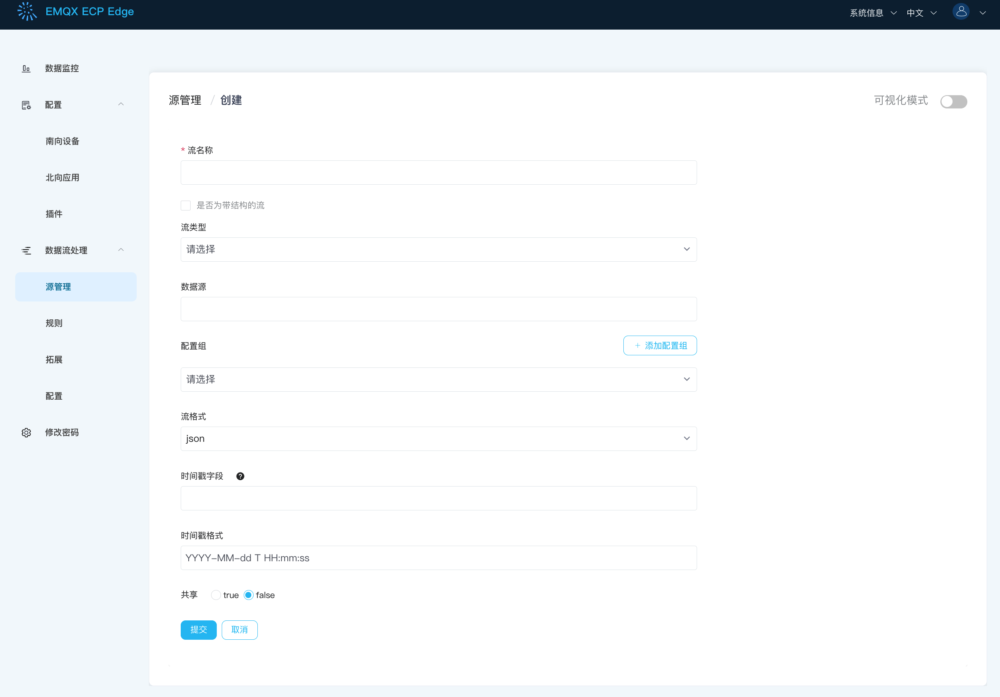

# 流管理

流是 ECP Edge 中数据源连接器的运行形式。它必须指定一个源类型来定义如何连接到外部资源。

当作为一个流使用时，源必须是无界的。流的作用就像规则的触发器。每个事件都会触发规则中的计算。

与关系型数据库不同，ECP Edge 不需要一个预先建立的模式。这使得它可以适应无模式的数据，这在物联网和边缘场景中很常见。在处理固定类型的数据流时，用户也可以像数据库一样定义模式，以便在编译时获得更多验证和 SQL 优化。在大多数情况下，无模式跳过了数据加载过程中的数据验证，这可能获得更好的性能。

## 流定义

流由两部分组成：

1. 流的模式定义。其语法与 SQL 表定义相同。这里的模式是可选的。如果它是空的，则流是无模式的。
2. 在 WITH 子句中定义连接器类型和行为的属性，如序列化格式。

```sql
CREATE STREAM   
    stream_name   
    ( column_name <data_type> [ ,...n ] )
    WITH ( property_name = expression [, ...] );
```

在 ECP Edge 页面，点击**数据流处理** -> **源管理**，在流管理页面，点击**创建流**按钮即可进行流的创建。



## 数据结构

流的数据结构 (schema) 包含两个部分。一个是在数据源定义中定义的数据结构，即逻辑数据结构；另一个是在使用强类型数据格式时指定的 SchemaId 即物理数据结构，例如 Protobuf 和 Custom 格式定义的数据结构。

ECP Edge 支持 3 种递进的数据结构方式：

1. Schemaless，用户无需定义任何形式的 schema，主要用于弱结构化数据流，或数据结构经常变化的情况。

2. 仅逻辑结构，用户在 source 层定义 schema，多用于弱类型的编码方式，例如最常用的 JSON。适用于用户的数据有固定或大致固定的格式，同时不想使用强类型的数据编解码格式。使用这种方式的情况下，可通过 StrictValidation 参数配置是否进行数据验证和转换。若数据格式完好，建议关闭验证。

   此时，用户需指定流字段类型，目前 ECP Edge 支持以下字段类型：

   | #    | 数据类型 | 说明                                                         |
   | ---- | -------- | ------------------------------------------------------------ |
   | 1    | bigint   | 整数型。                                                     |
   | 2    | float    | 浮点型。                                                     |
   | 3    | string   | 文本值，由 Unicode 字符组成。                                |
   | 4    | datetime | 日期时间类型。                                               |
   | 5    | boolean  | 布尔类型，值可以是`true` 或者 `false`。                      |
   | 6    | bytea    | 用于存储二进制数据的字节数组。如果在格式为 "JSON" 的流中使用此类型，则传入的数据需要为 base64 编码的字符串。 |
   | 7    | array    | 数组类型可以是任何简单类型，数组类型或结构类型。             |
   | 8    | struct   | 复杂类型。                                                   |

3. 物理结构，用户使用 protobuf 或者 custom 格式，并定义 schemaId。此时，数据结构的验证将由格式来实现。

ECP Edge 支持带结构/无结构的流，如为带结构的流，用户可自定义流字段结构， 例如对应 SQL 语句中的：

## 流类型

目前内置支持以下流类型，如不进行任何设置，将使用默认 MQTT 源。 

| 名称                        | 描述                                       |
| --------------------------- | ------------------------------------------ |
| [File](./file.md)           | 从文件中读取数据                           |
| [HTTP pull](./http_pull.md) | 从 HTTP 服务器中拉取数据                   |
| [HTTP push](./http_push.md) | 通过 HTTP 推送数据到 ECP Edge              |
| [Memory](./memory.md)       | 从 ECP Edge 内存主题读取数据以形成规则管道 |
| [MQTT](./mqtt.md)           | 从 MQTT 主题读取数据                       |
| [Neuron](./neuron.md)       | 从本地 Neuron 实例读取数据                 |

### 数据源

取决于不同的源类型；如果是 MQTT 源，则为 MQTT 数据源主题名；其它源请参考相关文档。

### 配置组

定义各类型数据源的相关配置项，具体可参考相关文档，默认为 default。

## 流格式

可选配置项，用于定义传入的数据类型，支持 json、protobuf、binary、delimited 和 custom，默认为 "JSON" 。该属性是否生效取决于源的类型，某些源自身解析的时固定私有格式的数据，则该配置不起作用。以下为其中部分流格式的介绍：

### Protocol Buffers

 Protocol Buffers (Protobuf) 是 Google 公司开发的一种数据序列化协议（像 XML，JSON 等）。Protobuf 是一种语言中立、平台中立、可扩展的序列化结构数据的方式，它更加简洁高效，能够实现数据的高效序列化。这种二进制格式的消息更小，更快，同时也更简单。

当流格式设置为 protobuf 时，还应配置解码时使用的模式。模式可在 数据流处理 -> 配置 -> 模式定义。有关模式的详细介绍，见 [模式](./configuration.md#模式)。

### Binary

对于二进制数据流，例如图像或者视频流，需要指定数据格式为 "BINARY" 。二进制流的数据为一个二进制数据块，不区分字段。所以，其流定义必须仅有一个 `bytea` 类型字段。如下流定义示例中，二进制流的数据将会解析为 `demoBin` 流中的 `image` 字段。

```sql
demoBin (
	image BYTEA
) WITH (DATASOURCE="test/", FORMAT="BINARY");
```

如果 "BINARY" 格式流定义为 schemaless，数据将会解析到默认的名为 `self` 的字段。

### delimited

如选择 delimited 格式，还应指定分隔符来区分数据字段，如 ","

## 时间戳与时间戳格式

时间戳代表该事件的时间戳。如设置，则使用此流的规则将采用事件时间；否则将采用处理时间。

时间戳格式为字符串和时间格式转换时使用的默认格式。

## 共享流

默认情况下，每个规则会创建自己的源实例。在某些场景中，用户需要不同的规则处理完全相同的数据流。例如，在处理传感器的温度数据时，用户可能需要一个规则，当一段时间的平均温度大于30度时触发警告；而另一个规则则是当一段时间的平均温度小于 0 度时触发警告。使用默认配置时，两个规则各自独立实例化源实例。由于网络延迟等原因，规则可能得到不同顺序，甚至各有缺失数据的数据流，从而在不同的数据维度中计算平均值。通过配置共享源实例，用户可以确保两个规则处理完全相同的数据。同时，由于节省了额外的源实例开销，规则的性能也能得到提升。

使用共享源实例模式，只需要共享源实例的流时，将其 `SHARED` 属性设置为 true 。

```
demo (
		...
	) WITH (DATASOURCE="test", FORMAT="JSON", KEY="USERID", SHARED="true");
```


## 示例

**示例1**

```sql
my_stream 
  (id bigint, name string, score float)
WITH ( datasource = "topic/temperature", FORMAT = "json", KEY = "id");
```

该流将订阅 MQTT 主题`topic/temperature`，服务器连接使用配置文件`$ekuiper/etc/mqtt_source.yaml` 中默认部分的 server 键。

- 有关更多信息，请参见 [MQTT source](../sources/builtin/mqtt.md)

**示例2**

```sql
demo (
		USERID BIGINT,
		FIRST_NAME STRING,
		LAST_NAME STRING,
		NICKNAMES ARRAY(STRING),
		Gender BOOLEAN,
		ADDRESS STRUCT(STREET_NAME STRING, NUMBER BIGINT),
	) WITH (DATASOURCE="test/", FORMAT="JSON", KEY="USERID", CONF_KEY="demo");
```

流将订阅 MQTT 主题 `test/`，服务器连接使用配置文件`$ekuiper/etc/mqtt_source.yaml` 中 demo 部分的设置。

**示例3**

```sql
demo () WITH (DATASOURCE="test/", FORMAT="protobuf", SCHEMAID="proto1.Book");
```

流将订阅 MQTT 主题 `test/`，使用 PROTOBUF 格式，根据在 `$ekuiper/data/schemas/protobuf/schema1.proto` 文件中的 `Book` 定义对流入的数据进行解码。其中，模式的管理详见[模式注册表](../serialization/serialization.md#模式)。

- 有关更多信息，请参见 [MQTT source](../sources/builtin/mqtt.md)

- 有关规则和流管理的更多信息，请参见 [规则和流 CLI docs](../../api/cli/overview.md)


