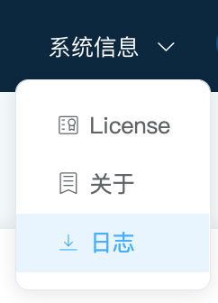

# 管理日志

::: warning

这个页面需要整体更新

:::

## 下载日志

ECP Edge 支持在 web 页面一键下载所有日志文件的功能，如下图所示。



下载日志的功能将把 /neuron/build/logs 的文件夹打包成 neuron_logs.tar.gz 文件并下载到网页上。文件包含所有已创建的驱动及 neuron 的日志文件，文件目录级别示例，如下图所示。


* data-stream-processing.log：数据处理配置；
* dlt645.log：北向应用配置；
* modbus-plus-tcp.log：南向设备配置；
* neuron.log：Neuron 日志

## 设置打印节点 debug 日志

Neuron 支持设置打印某个节点的 debug 日志，并在大致十分钟后自动切回默认的日志等级。每个节点之间的设置相互独立。

每个节点的 `更多` 操作按键中都有一个 `DEBUG 日志` 的操作按键，如下图所示。


点击此按键后，页面将跳出如下图所示的提示。


此时，该节点开始打印 debug 日志，用户可选择在十分钟后下载日志，查看对应节点的日志，也可以选择在 /build/logs 下实时查看节点打印的日志。

:::tip
打印节点 debug 日志的同时 neuron 日志也会打印，并在十分钟后自动切回默认的日志等级。
:::

## zlog.conf

日志配置文件说明。

```bash
[global]

file perms = 666

[formats]

simple = "%d [%V] %f:%L %m%n"

[rules]

*.*     "./logs/%c.log", 50MB * 1 ~ "./logs/%c.#2s.log"; simple
```

### 全局参数 Global

file perms：指定创建文件的缺省访问权限。
* 600，只有拥有者有读写权限；
* 644，只有拥有者有读写权限；而属组用户和其他用户只有读权限；
* 700，只有拥有者有读、写、执行权限；
* 755，拥有者有读、写、执行权限；而属组用户和其他用户只有读、执行权限；
* 711，拥有者有读、写、执行权限；而属组用户和其他用户只有执行权限；
* 666，所有用户都有文件读、写权限；
* 777，所有用户都有读、写、执行权限。

### 格式 Formats
转换格式串：转换格式串类似 C 的 printf 函数。
* %d，打印日志时间；
* %V，日志级别，大写；
* %f，源代码文件名；
* %L，源代码行数；
* %m，用户日志，用户从 zlog 函数输入的日志；
* %n，换行符。

### 规则 Rules

规则描述了日志是怎么被过滤、格式化以及被输出的。
语法：

> (category).(level)    (output),(options, optional); (format name, optional)</span>

#### category

分类等级。

| 总结                         | 配置文件规则分类 | 匹配的代码分类               | 不匹配的代码分类         |
| --------------------------- | -------------- | ------------------------- | ---------------------- |
|*匹配所有                     | \*.\*            | aa，aa_bb，aa_cc，yy ...    | NONE                   |
| 以_结尾的分类匹配本级及下级分类  | aa_.*          | aa, aa_bb, aa_cc, aa_bb_cc | xx, yy                 |
| 不以_结尾的精确匹配分类名       | aa.*           | aa                         | aa_bb, aa_cc, aa_bb_cc |
| ！匹配没有找到规则的分类        | !.*            | xx                         | aa                     |

#### level

zlog 有六个默认的等级：“DEBUG”,“INFO”，“NOTICE”，“WARN”，“ERROR”，“FATAL”。例如，*.DEBUG 任何大于等于 DEBUG 级别的日志都会被输出。

| 表达式    | 含义               |
| -------- | ----------------- |
| \*.\*        | 所有等级            |
| *.debug  | 代码内等级 >= debug |
| *.=debug | 代码内等级 == debug |
| *.!debug | 代码内等级 != debug |

#### (output),(options, optional);

[输出],[附加选项，可选];

| 动作            | 输出字段     | 附加选项 |
| -------------- | ----------- | ------- |
| 标准输出        | >stdout     | 无意义 |
| 标准错误输出     | >stderr     | 无意义 |
| 输出到syslog    | >syslog     | syslog设施(facilitiy)：LOG_USER(default)，LOG_LOCAL[0-7] 必填 |
| 管道输出	      | \|cat        | 无意义 |
| 文件           | "文件路径"    | 文件转档，10M * 3 ～ "press.#r.log"。例如，"./logs/%c.log", 50MB * 1 ~ "./logs/%c.#2s.log" 表示每到 50M 转档，#2s 的意思是序号的长度最少为 2 位，从 00 开始编号。 |
| 同步IO文件      | -"文件路径"   |    |
| 用户自定义输出   | $name        | "path" 动态或者静态的用于record输出|
#### (format name, optional)

[格式名，可选]